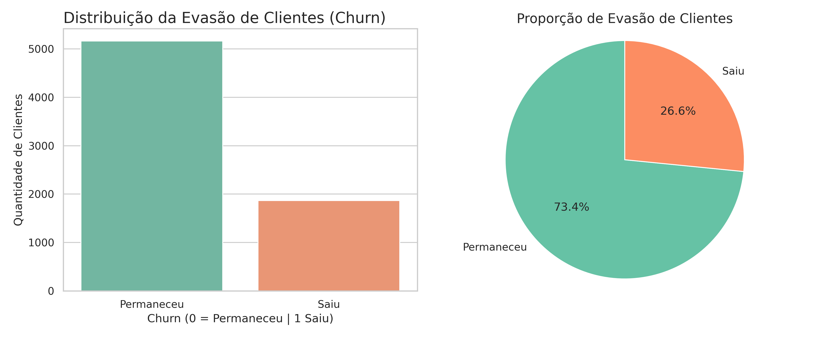

# 📊 Desafio de Data Science - Análise de Evasão de Clientes (Churn) | Telecom X

Este repositório contém a solução para o desafio proposto pela **Telecom X**, com foco na **análise de evasão de clientes (churn)**. O objetivo é entender os fatores que influenciam a saída de clientes da empresa, utilizando Python e bibliotecas de análise de dados.

---

## 🎯 Objetivo

A empresa Telecom X está enfrentando um alto índice de cancelamentos de contratos. Este projeto tem como objetivo:

- Coletar e tratar os dados de clientes disponibilizados via API.
- Explorar e entender o comportamento dos clientes.
- Identificar padrões e possíveis causas de evasão.
- Preparar os dados para modelagens futuras e auxiliar na tomada de decisão.

---

## 📊 Visualização da Evasão de Clientes (Churn)

A seguir, apresentamos dois gráficos que ilustram a distribuição da variável `churn`, responsável por indicar se o cliente deixou ou permaneceu na empresa:

- **Gráfico de Barras**: mostra a contagem absoluta de clientes que saíram (`1`) e que permaneceram (`0`).
- **Gráfico de Pizza**: mostra a proporção percentual entre os dois grupos.

| Distribuição Absoluta | Distribuição Percentual |
|-----------------------|-------------------------|
|  |  |

> 📌 Os gráficos acima revelam que cerca de **26,6% dos clientes saíram da empresa**, enquanto **73,4% permaneceram**.

---

## 🔧 Tecnologias e Ferramentas

- Python 3.10+
- Pandas
- NumPy
- Google Colab 
- Matplotlib
- Seaborn 

---

## 🧪 Etapas do Projeto

- ✅ Extração de dados da API (formato JSON)
- ✅ Tratamento e normalização dos dados (ETL)
- ✅ Análise da estrutura do dataset
- ✅ Verificação e correção de inconsistências
- ✅ Criação de colunas derivadas (como `contas_diarias`)
- 🔄 Padronização de colunas e variáveis
- 🚧 Análise exploratória de dados (EDA) [em andamento]
- 🚀 Modelagem preditiva (etapa futura)

---

## 📁 Estrutura dos Dados

O dataset inclui colunas como:

- `customer_id`, `churn`, `tenure`, `monthly_charges`, `contract`, `internet_service`, entre outras.
- Serviços adicionais: `tech_support`, `streaming_tv`, `online_backup`, etc.
- Coluna criada: `contas_diarias` → estimativa do gasto diário do cliente.

---

## ✍️ Autor

Desenvolvido por [Mateus Sanfer - https://github.com/MateusSanfer] como parte de um desafio de análise de dados.

---

## 📌 Observações

- Os dados utilizados são fictícios e disponibilizados para fins educacionais.
- O projeto está em construção e será atualizado conforme as etapas forem avançando.

